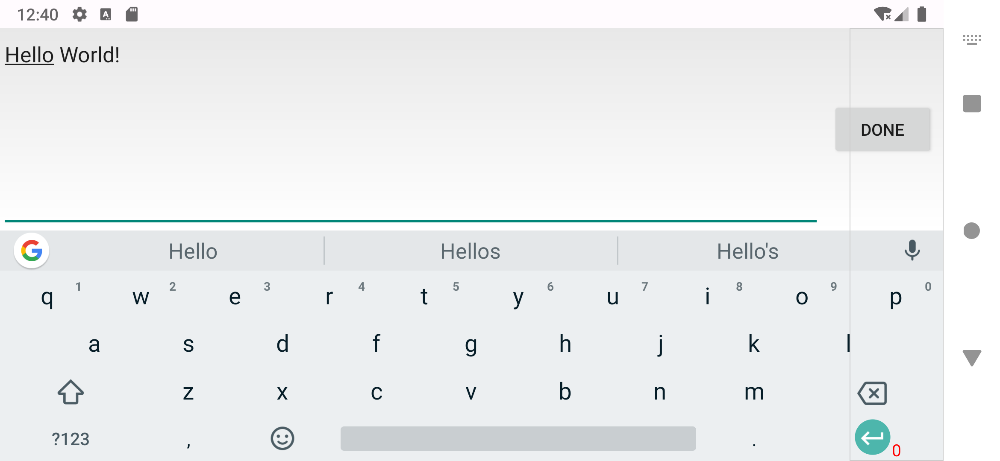

# SoftKeyboardGlobal 

May be the best solution for Android soft keyboard listening。


## Installation

Add **jitpack** to your `settings.gradle.kts`.

```groovy
dependencyResolutionManagement {
    repositoriesMode.set(RepositoriesMode.FAIL_ON_PROJECT_REPOS)
    repositories {
        mavenCentral()
        maven { url 'https://jitpack.io' }
    }
}
```

then, add dependency.

```groovy
dependencies {
    implementation 'com.github.boybeak:skb-global:Tag'
}
```
The newest version is: 

# Usage
You can use it **globally** or **locally**.

### Globally
Initialize `SoftKeyboardGlobal` before using it.

```kotlin
class App : Application() {

    override fun onCreate() {
        super.onCreate()
        SoftKeyboardGlobal.install(this, true)
    }
}
```
You can pass `true` to second parameter to display a debug UI indicator.

```kotlin
SoftKeyboardGlobal.addSoftKeyboardCallback(object : SoftKeyboardGlobal.SoftKeyboardCallback {
    override fun onOpen(height: Int) {
        Log.d(TAG, "onOpen height=$height")
    }

    override fun onClose() {
        Log.d(TAG, "onClose")
    }

    override fun onHeightChanged(height: Int) {
        Log.d(TAG, "onHeightChanged height=$height")
    }
})
```

You can observe soft keyboard state change and height change at any where in your app.

### Locally
```kotlin
class MainActivity : AppCompatActivity() {

    private val observer by lazy { KeyboardObserver.create(this, true) }
    private val switchBtn: SwitchCompat by lazy { findViewById(R.id.switchBtn) }

    override fun onCreate(savedInstanceState: Bundle?) {
        super.onCreate(savedInstanceState)
        setContentView(R.layout.activity_main)

        switchBtn.setOnCheckedChangeListener { buttonView, isChecked ->
            if (isChecked) {
                observer.watch()
            } else {
                observer.unwatch()
            }
        }
    }
}
```
You can pass `true` to second parameter when creating a `KeyboardObserver` to display a debug UI indicator.

## Q&A
### 1. Landscape problem
The `EditText`'s default behavior for landscape is **ExtractUi**.



You need add `android:imeOptions="flagNoExtractUi"` to your `EditText` in xml or use `editText.imeOptions = EditorInfo.IME_FLAG_NO_EXTRACT_UI` in program.